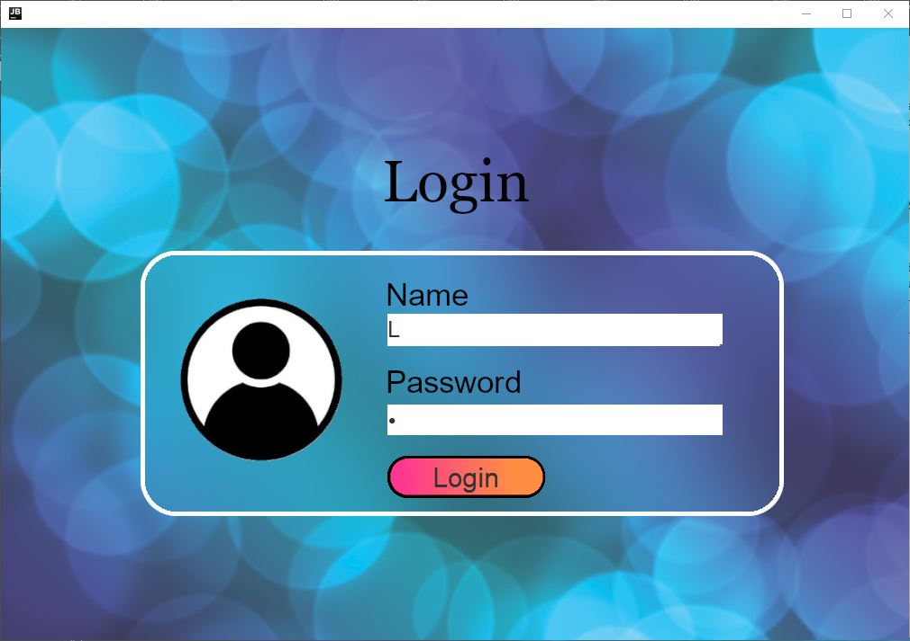
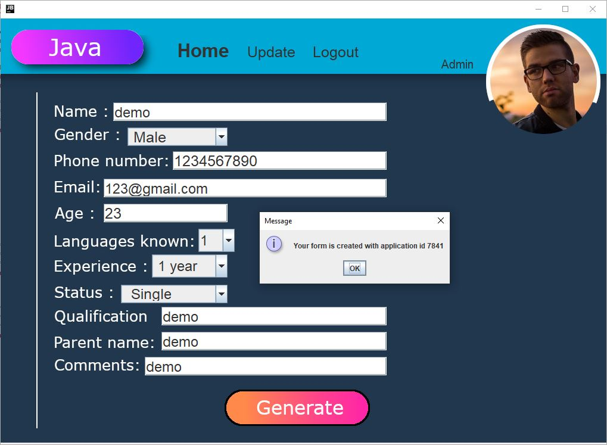
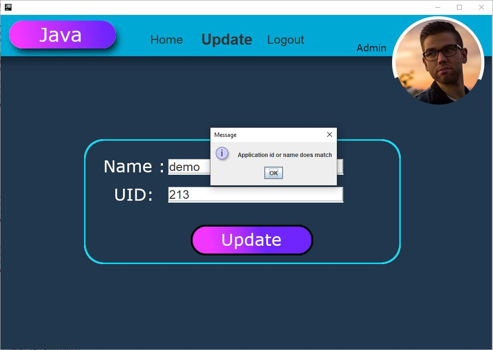

# Enhanced job application using java
In this project I have created a simple Graphical interface job application with unique id and easy refactor system.
This application also have a login page where company can have admin rights.

# Authentication for this program
Id is "L"
Password is "1"
In this Application I have used file handling system to store a local file and also to refactor.

# Software Used:
1)For creating this program i have used eclipse ,
2)Library used are swing and window builder to build to UI , 
3)Additional software used are gimp for background images.
# ---------------------------------------------------------------
# This program is only for education purpose
# ---------------------------------------------------------------
# Following are some images of the software

